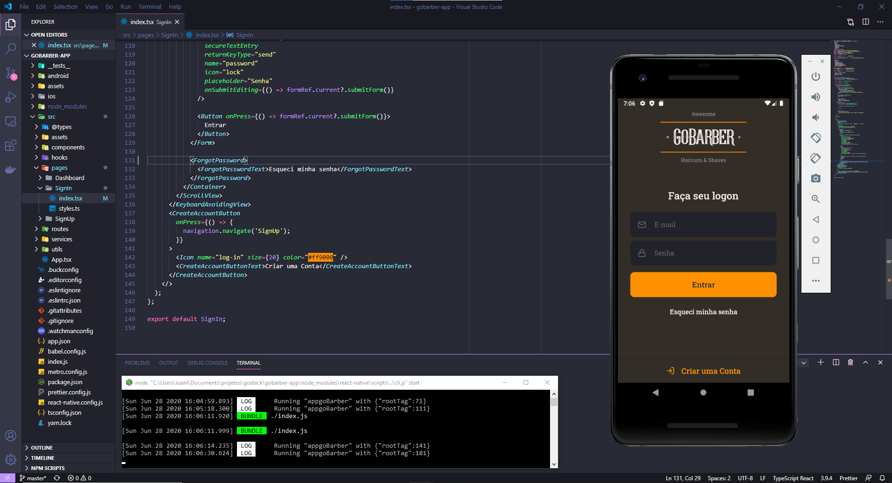

<h1 align="center">
  
</h1>

<h3 align="center">
  Mobile Application for GoBarber
</h3>



<p align="center">
  

  <a href="https://www.linkedin.com/in/ruan-xavier/" target="_blank" rel="noopener noreferrer">
    
  </a>

  

  <a href="https://github.com/ruandsx/gobarber-app/commits/master">
    
  </a>

  

  
</p>

<p align="center">
  <a href="#%EF%B8%8F-about-the-project">About the project</a>&nbsp;&nbsp;&nbsp;|&nbsp;&nbsp;&nbsp;
  <a href="#-technologies">Technologies</a>&nbsp;&nbsp;&nbsp;|&nbsp;&nbsp;&nbsp;
  <a href="#-getting-started">Getting started</a>&nbsp;&nbsp;&nbsp;|&nbsp;&nbsp;&nbsp;
  <a href="#-how-to-contribute">How to contribute</a>&nbsp;&nbsp;&nbsp;|&nbsp;&nbsp;&nbsp;
  <a href="#-license">License</a>
</p>

## 💇🏻‍♂✂ About the project

This mobile version provides everything needed to schedulee appointments.

Users can see all their appointments and schedule new ones.
Also they can edit the profile.

To see the **api**, click here: [GoBarber API](https://github.com/ruandsx/gobarber-backend)<br />
To see the **web client**, click here: [GoBarber Web](https://github.com/ruandsx/gobarber-web)

## 💻🛠 Technologies


Technologies that I used:
- [TypeScript](https://www.typescriptlang.org/)
- [React Native](https://reactnative.dev/)
- [React Navigation](https://reactnavigation.org/)
- [React Native Vector Icons](https://github.com/oblador/react-native-vector-icons)
- [UnForm](https://unform.dev/) [💜](https://rocketseat.com.br/)
- [Yup](https://github.com/jquense/yup)
- [Styled Components](https://styled-components.com/)
- [Axios](https://github.com/axios/axios)
- [Eslint](https://eslint.org/)
- [Prettier](https://prettier.io/)

## 💻🖥 Getting started


### Requirements

- [Node.js](https://nodejs.org/en/)
- [Yarn](https://classic.yarnpkg.com/) or [npm](https://www.npmjs.com/)
- Have this application's [API](https://github.com/ruandsx/gobarber-backend) running OR being certified that [Deployed API](https://gobarber.rxsoftwares.com) is running

**Clone the project and access the folder**

```bash
$ git clone https://github.com/ruandsx/gobarber-app.git && cd gobarber-app
```
**Follow the steps below**

```bash
# Install the dependencies
$ yarn
# Be sure the file 'src/services/api.ts' have the IP to your API or to the online version (https://gobarber.rxsoftwares.com)

# If you are going to emulate with android, run this command
# Be sure to have the emulator open
$ yarn android

# If you are going to emulate with ios, run this commands
$ cd ios
$ pod install
$ yarn ios
```

## 🤔 How to contribute

**Make a fork of this repository**

```bash
# Fork using GitHub official command line
# If you don't have the GitHub CLI, use the web site to do that.
$ gh repo fork ruandsx/gobarber-app
```

**Follow the steps below**

```bash
# Clone your fork
$ git clone your-fork-url && cd gobarber-app
# Create a branch with your feature
$ git checkout -b my-feature
# Make the commit with your changes
$ git commit -m 'feat: My new awesome feature'
# Send the code to your remote branch
$ git push origin my-feature
```

## 📝 License

This project is licensed under the MIT License

---

Made with 💛 by 👨‍💻[Ruan Xavier](https://www.linkedin.com/in/ruan-xavier/)
